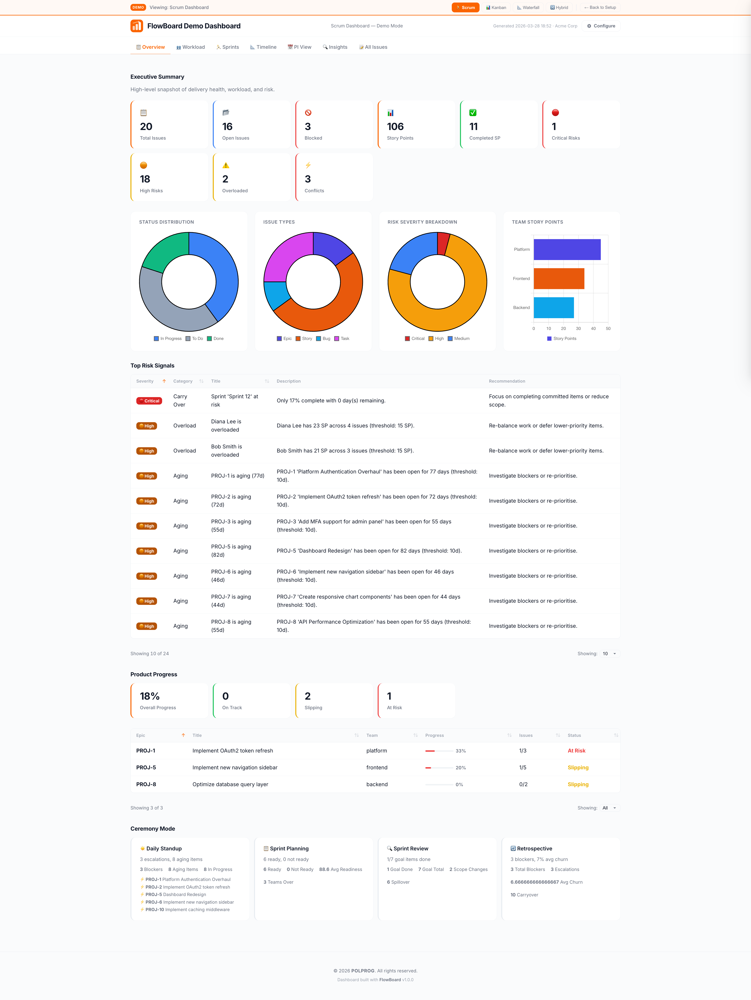
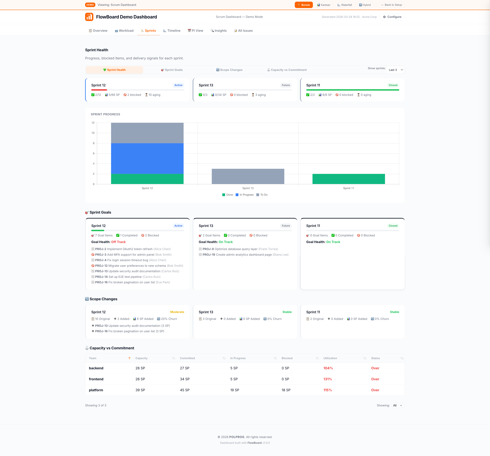
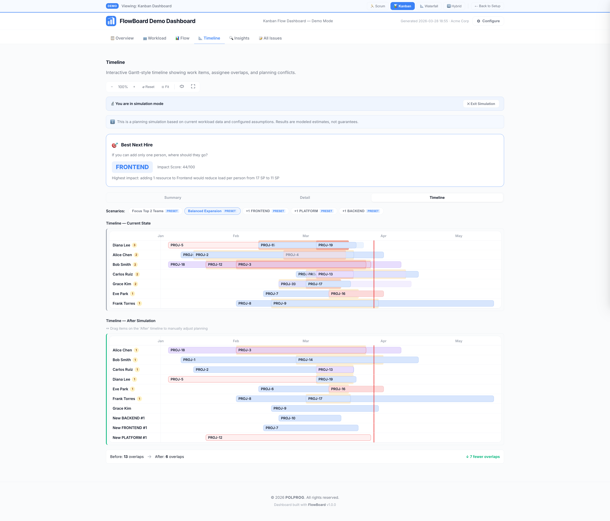

<p align="center">
  
</p>

<p align="center">
  <a href="https://www.python.org/"></a>
  
  <a href="LICENSE"></a>
  
</p>

<p align="center">
  <b>Transform Jira data into interactive, decision-oriented HTML dashboards — instantly.</b><br>
  <sub>Delivery Intelligence · Workload Analytics · Sprint Health · Roadmap Tracking · What-If Simulation · Risk Detection</sub>
</p>

<p align="center">
  <a href="#what-is-flowboard">What is FlowBoard?</a> •
  <a href="#screenshots">Screenshots</a> •
  <a href="#features">Features</a> •
  <a href="#installation">Installation</a> •
  <a href="#quick-start">Quick Start</a> •
  <a href="#configuration">Configuration</a> •
  <a href="#dashboard">Dashboard</a> •
  <a href="#cli-reference">CLI</a> •
  <a href="#architecture">Architecture</a> •
  <a href="#testing">Testing</a>
</p>

---

## What is FlowBoard?

FlowBoard is a Jira-powered delivery intelligence tool that generates self-contained HTML dashboards for engineering managers, Scrum masters, product owners, and leadership. It fetches live data from Jira Cloud, Server, or Data Center, runs analytics locally, and produces a single portable HTML file — no server, no database, no ongoing infrastructure.

Open the file in any browser and get immediate answers to the questions that drive delivery decisions:

- **Who is overloaded?** — capacity matrix with per-person story points, WIP counts, and overload alerts
- **Is the sprint on track?** — progress bars, blocked items, aging work, carry-over risk
- **Are epics slipping?** — roadmap timeline with progress percentages and risk badges
- **Where are delivery risks?** — automated risk detection across six categories
- **What's blocking us?** — dependency chains, critical blockers, cross-team friction
- **What happens if we add a resource to API?** — what-if capacity simulation with instant metric deltas
- **Are there scheduling conflicts?** — resource contention, priority pile-ups, timeline overlaps
- **How healthy is the team?** — sprint goals, velocity trends, blocker patterns

---

## Screenshots

### Overview Dashboard

Executive Summary with metric cards, status distribution charts, risk severity breakdown, team story points, top risk signals, product progress with epic tracking, and ceremony mode — all in a single scrollable view.

<p align="center">
  
</p>

### Sprint Health & Goals

Sprint Health tab with progress bars, completion tracking, sprint goals with blocked item alerts, scope change analysis with churn percentages, and capacity vs. commitment table per team.

<p align="center">
  
</p>

### What-If Simulation

Interactive capacity simulation with Gantt-style before/after timelines, "Best Next Hire" recommendation engine, preset scenarios, and overlap reduction tracking — shown here in Kanban mode.

<p align="center">
  
</p>

---

## Features

### Delivery Intelligence

- **Automated Risk Detection** — identifies overload, aging work, blocked chains, scope creep, sprint danger, and deadline risk across every issue
- **Dependency Analysis** — maps blocking chains, critical blockers, and cross-team dependencies with source/target status tracking
- **Workload Distribution** — per-person and per-team story point allocation with configurable overload thresholds
- **Sprint Health Scoring** — progress percentages, blocked item counts, aging alerts, and carry-over risk indicators
- **Roadmap Tracking** — epic-level timeline with progress bars, start/target dates, owner attribution, and risk badges
- **Conflict Detection** — surfaces resource contention, priority pile-ups, and timeline overlaps automatically
- **Executive Summary** — instant-scan cards for total issues, blocked items, open story points, critical risks, and overloaded team members
- **Severity Classification** — risk signals sorted and color-coded by severity with configurable display modes
- **Chart Analytics** — Chart.js-powered doughnut, bar, and stacked charts for status distribution, type breakdown, and workload visualization

### Interactive Dashboard

- **8 Main Tabs** — Overview, Workload, Sprints, Timeline, PI / Roadmap, Insights, Dependencies, and Issues
- **17 Sub-Views** — each tab expands into focused views (timeline alone has 6 modes: Assignee, Team, Epic, Conflict, Executive, Simulation)
- **5 Built-In Themes** — light, dark, midnight, slate, and system (auto-detect) — switchable at runtime
- **Settings Drawer** — 36 controls across 5 cards for branding, thresholds, layout, chart, and timeline configuration
- **Global Search & Filter** — search/filter across all issue tables, timeline swimlanes, and dependency graphs
- **JSON & CSV Export** — export workload data, risk registers, and full issue lists in structured formats
- **Zoom & Navigation** — timeline zoom controls, today marker, sprint boundaries, and swimlane filtering
- **Responsive Layout** — density modes (compact, comfortable, spacious) with field-level visibility controls
- **Config Import/Export** — save and restore dashboard settings as JSON with schema validation

### Capacity Simulation

- **What-If Scenarios** — model the impact of adding or removing team members before making staffing decisions
- **Preset Scenarios** — auto-generated "add one person to each team" presets for quick comparison
- **Custom Scenarios** — define arbitrary resource changes across multiple teams in a single simulation run
- **Metric Deltas** — instant before/after comparison of average load, max load, overloaded count, collisions, and utilization
- **Team Impact Analysis** — per-team scoring showing which teams benefit most from proposed changes
- **Auto-Recommendations** — engine-generated hiring, capacity pressure, and blocker resolution advice

### Scrum Analytics

- **Sprint Health Dashboard** — progress bars, completion percentages, and velocity indicators per sprint
- **Goal Tracking** — sprint goal completion status with blocked goal alerts
- **Blocker Analysis** — blocked item identification with aging duration and dependency chain context
- **Carry-Over Risk** — flags items at risk of spilling into the next sprint based on progress and remaining effort
- **Aging Detection** — highlights work items that have exceeded configurable age thresholds

---

## Table of Contents

- [What is FlowBoard?](#what-is-flowboard)
- [Screenshots](#screenshots)
- [Features](#features)
- [Installation](#installation)
- [Quick Start](#quick-start)
- [Configuration](#configuration)
- [Jira Enterprise Integration](#jira-enterprise-integration)
- [Web Server Mode](#web-server-mode)
- [Dashboard](#dashboard)
- [Settings & Customization](#settings--customization)
- [CLI Reference](#cli-reference)
- [Architecture](#architecture)
- [Internationalization](#internationalization)
- [OpsPortal Integration](#opsportal-integration)
- [Troubleshooting](#troubleshooting)
- [Development](#development)
- [Testing](#testing)
- [Documentation](#documentation)
- [Contributing](#contributing)
- [License](#license)

## Installation

**Requirements:** Python ≥ 3.12

```bash
git clone https://github.com/POLPROG-TECH/FlowBoard.git && cd FlowBoard
python3 -m venv .venv && source .venv/bin/activate
pip install -e ".[dev]"
```

Verify the installation:

```bash
flowboard version
# FlowBoard 1.0.0
```

> **Corporate network (Zscaler / VPN)?** If `pip install` fails with SSL errors, see [Corporate Network setup](#corporate-network-zscaler--vpn--proxy) below.

### Corporate Network (Zscaler / VPN / Proxy)

If you're behind a corporate proxy that intercepts HTTPS (e.g. Zscaler, Netskope), you need to export the corporate CA bundle **before** installing dependencies or connecting to Jira.

<details>
<summary><b>macOS / Linux</b></summary>

```bash
# 1. Export corporate CA certificates (macOS)
security find-certificate -a -p \
  /Library/Keychains/System.keychain \
  /System/Library/Keychains/SystemRootCertificates.keychain \
  > ~/combined-ca-bundle.pem

# On Linux, the CA bundle is usually already available:
#   /etc/ssl/certs/ca-certificates.crt          (Debian/Ubuntu)
#   /etc/pki/tls/certs/ca-bundle.crt            (RHEL/Fedora)
# If your proxy adds its own CA, ask your IT department for the .pem file
# and append it: cat corporate-ca.pem >> ~/combined-ca-bundle.pem

# 2. Configure SSL trust (add to ~/.zshrc or ~/.bashrc to persist)
export SSL_CERT_FILE=~/combined-ca-bundle.pem
export REQUESTS_CA_BUNDLE=~/combined-ca-bundle.pem

# 3. (Optional) Also configure git to use the same CA bundle
git config --global http.sslCAInfo ~/combined-ca-bundle.pem

# 4. Install
python3 -m venv .venv && source .venv/bin/activate
pip install -e ".[dev]"

# 5. Set Jira credentials
export FLOWBOARD_JIRA_TOKEN="your-jira-api-token"
export FLOWBOARD_JIRA_EMAIL="your-email@company.com"
export FLOWBOARD_JIRA_URL="https://your-company.atlassian.net"

# 6. Start
flowboard serve
```
</details>

<details>
<summary><b>Windows (PowerShell)</b></summary>

```powershell
# 1. Export corporate CA certificate
# Ask your IT department for the corporate CA .pem file, or export it from
# certmgr.msc → Trusted Root Certification Authorities → Certificates
# Right-click → All Tasks → Export → Base-64 encoded X.509 (.CER)
# Save as: %USERPROFILE%\corporate-ca-bundle.pem

# 2. Configure SSL trust (add to your PowerShell profile to persist)
$env:SSL_CERT_FILE = "$env:USERPROFILE\corporate-ca-bundle.pem"
$env:REQUESTS_CA_BUNDLE = "$env:USERPROFILE\corporate-ca-bundle.pem"

# 3. (Optional) Also configure git to use the same CA bundle
git config --global http.sslCAInfo "$env:USERPROFILE\corporate-ca-bundle.pem"

# 4. Install
python -m venv .venv
.venv\Scripts\Activate.ps1
pip install -e ".[dev]"

# 5. Set Jira credentials
$env:FLOWBOARD_JIRA_TOKEN = "your-jira-api-token"
$env:FLOWBOARD_JIRA_EMAIL = "your-email@company.com"
$env:FLOWBOARD_JIRA_URL = "https://your-company.atlassian.net"

# 6. Start
flowboard serve
```

> **Tip:** To make environment variables permanent on Windows, use `[System.Environment]::SetEnvironmentVariable("SSL_CERT_FILE", "$env:USERPROFILE\corporate-ca-bundle.pem", "User")` or set them via System Properties → Environment Variables.
</details>

## Quick Start

### Web Server (recommended)

```bash
# Start the dashboard server
flowboard serve
# → http://127.0.0.1:8084
```

The dashboard launches with a setup page if no configuration exists, and streams real-time progress via SSE during analysis.

> **No Jira?** Run `flowboard demo` to generate a fully populated dashboard from built-in mock data. Or start the server and trigger demo via API: `curl -X POST http://127.0.0.1:8084/api/demo`

### With Jira Configuration

1. **Configure** — copy the example and fill in your Jira details:
   ```bash
   cp examples/config.example.json config.json
   ```

2. **Validate** — ensure the config is correct before fetching:
   ```bash
   flowboard validate-config --config config.json
   ```

3. **Verify** — test connectivity to your Jira instance:
   ```bash
   flowboard verify --config config.json
   ```

4. **Generate** — fetch data and produce the dashboard:
   ```bash
   flowboard generate --config config.json
   ```

5. **Open** — view the result in any browser:
   ```bash
   open output/dashboard.html
   ```

## Configuration

Minimal configuration to get started:

```json
{
  "jira": {
    "base_url": "https://your-org.atlassian.net",
    "projects": ["PROJ"]
  },
  "output": {
    "path": "output/dashboard.html"
  }
}
```

### Environment Variables

| Variable | Purpose |
|----------|---------|
| `FLOWBOARD_JIRA_TOKEN` | Jira API token (Cloud) or Personal Access Token (Server/DC) |
| `FLOWBOARD_JIRA_EMAIL` | Jira account email (required for Cloud basic auth) |
| `FLOWBOARD_JIRA_URL` | Override `jira.base_url` from config |
| `FLOWBOARD_LOCALE` | Override locale (`en` or `pl`) |

```bash
export FLOWBOARD_JIRA_EMAIL="you@company.com"
export FLOWBOARD_JIRA_TOKEN="your-jira-api-token"
```

### Configuration Features

- **JSON Schema Validation** — every config file validated against `config.schema.json` before execution
- **Environment Variable Overrides** — credentials and locale injected via `FLOWBOARD_JIRA_*` variables, never stored in config
- **Config Import/Export** — share dashboard configurations across teams with portable JSON files
- **Sensible Defaults** — minimal required config (Jira URL + project key + output path) with everything else optional

See [docs/configuration.md](docs/configuration.md) for the full configuration reference with all keys, defaults, and examples.

## Jira Enterprise Integration

FlowBoard connects to **Jira Cloud**, **Jira Server**, and **Jira Data Center** via REST API.

- **Basic Auth** — email + API token (Jira Cloud)
- **Bearer / PAT** — Personal Access Token (Jira Server & Data Center)
- **Custom Fields** — map organisation-specific fields for story points, sprints, and epics
- **Environment Variable Override** — inject credentials at runtime without touching config files

See [docs/jira-enterprise.md](docs/jira-enterprise.md) for setup instructions, field mappings, and authentication details.

## Web Server Mode

The web server is FlowBoard's **primary operating mode**. It serves an interactive dashboard via FastAPI with Jinja2 SSR, provides a REST API, and streams analysis progress in real time over SSE.

### Startup

```bash
flowboard serve [OPTIONS]
```

| Option | Default | Description |
|--------|---------|-------------|
| `--config`, `-c` | `config.json` | Path to Jira configuration file |
| `--host` | `127.0.0.1` | Bind address |
| `--port`, `-p` | `8084` | Bind port |
| `--verbose`, `-v` | off | Enable debug logging |

For programmatic or ASGI deployment:

```python
from flowboard.web.server import create_app

app = create_app("config.json", first_run=False, root_path="")
```

### API Endpoints

FlowBoard exposes 16 routes covering health checks, analysis control, data export, and configuration.

**Health & Status**
- `GET /health/live` — liveness probe
- `GET /health/ready` — readiness probe
- `GET /api/status` — version, uptime, and analysis state

**Analysis** — trigger the Jira fetch + analysis pipeline, cancel running analysis, stream progress via SSE, and retrieve results.

**Export** — download the dashboard as self-contained HTML, CSV (issues/workload/risks), or JSON snapshot.

**Demo & Configuration** — generate demo dashboards from mock data, test Jira connectivity, view current config.

See [docs/usage.md](docs/usage.md) for detailed endpoint documentation and examples.

### Iframe Embedding

To embed the dashboard in an iframe (e.g., inside OpsPortal), set:

```bash
export FLOWBOARD_ALLOW_FRAMING=true
```

## Dashboard

### Tabs & Views

| Tab | Sub-Views | Description |
|-----|-----------|-------------|
| **Overview** | Executive Summary, Product Progress, Ceremonies | Key metric cards, status/type distribution charts, top risk signals |
| **Workload** | Capacity Matrix, Backlog Quality, Sprint Readiness | Per-person story points, issue counts, WIP tracking with threshold highlighting |
| **Sprints** | Sprint Health, Goals, Scope Changes, Capacity vs. Commitment | Progress bars, completion %, goal status, blocked items, aging, carry-over risk |
| **Timeline** | Assignee, Team, Epic, Conflict, Executive, Simulation | Gantt-style interactive timeline with 6 switchable modes, zoom, and filtering |
| **PI / Roadmap** | Sprint Slots, Epic Progress | Program Increment timeline with sprint boundaries, epic progress, and risk badges |
| **Insights** | Risks, Blockers, Delivery Forecast, Dependency Heatmap | Risk register, blocker aging, epic-level risk forecast, cross-team dependency matrix |
| **Dependencies** | Table, Heatmap | Unresolved blocking dependency table with source/target status and chain depth |
| **Issues** | Full Issue List | Sortable, filterable table with all normalised Jira issues and metadata |

## Settings & Customization

The dashboard ships with a built-in settings drawer containing **36 controls** across **5 cards**:

- **Branding** — title, subtitle, company name, primary/secondary/tertiary colours
- **Thresholds** — aging days, overload points, overload issues, WIP limit, capacity per person
- **Layout** — density mode, visible tabs, field density, chart toggles
- **Timeline** — default mode, compact view, overlap visibility, sprint boundaries, today marker, default zoom
- **Actions** — apply, cancel, reset, import config, export config

All settings are persisted in the browser and can be exported/imported as JSON with full schema validation.

See [docs/usage.md](docs/usage.md) for detailed settings documentation.

## CLI Reference

| Command | Syntax | Description |
|---------|--------|-------------|
| `generate` | `flowboard generate --config <path> [--output <path>] [--locale <code>]` | Fetch Jira data and produce the HTML dashboard |
| `validate-config` | `flowboard validate-config --config <path>` | Validate a config file against the JSON schema |
| `verify` | `flowboard verify --config <path>` | Test connectivity to the configured Jira instance |
| `demo` | `flowboard demo [--output <path>] [--locale <code>]` | Generate a dashboard from built-in mock data (no Jira required) |
| `version` | `flowboard version` | Print the FlowBoard version and exit |

## Architecture

```
src/flowboard/
├── cli/              # Typer CLI (generate, validate, verify, demo)
├── application/      # Orchestration, services
├── domain/           # Models, risk, timeline, scrum, simulation, dependencies
├── infrastructure/   # Jira client, config loader, schema validation
├── i18n/             # Translator, en.json, pl.json (927 keys)
├── presentation/     # HTML renderer, Jinja2 templates, components
└── shared/           # Types, enums, constants
```

**Design principles:**

- **Domain isolation** — the domain layer has zero infrastructure imports; all analytics are pure functions on domain objects
- **Boundary translation** — Jira JSON is normalised at the infrastructure boundary and never leaks into domain or presentation
- **Snapshot-driven rendering** — the presentation layer consumes a `BoardSnapshot` dataclass, never raw Jira data
- **Schema-first config** — configuration is loaded once, validated against `config.schema.json`, and threaded through as an immutable object
- **Self-contained output** — the generated HTML embeds all CSS and JavaScript inline; only Chart.js is loaded via CDN
- **Extensible i18n** — every user-facing string is a translation key; adding a locale requires only a new JSON file

See [docs/architecture.md](docs/architecture.md) for the full design document.

## Internationalization

FlowBoard ships with full internationalisation support:

| Locale | Language | Keys |
|--------|----------|------|
| `en` | English | 927 |
| `pl` | Polish | 927 |

- **Auto-detection** — locale resolved from CLI flag → environment variable → config file → system default
- **Pluralisation** — context-aware plural forms for counts (e.g., "1 issue" vs. "5 issues")
- **Locale-aware formatting** — dates, numbers, and percentages formatted per locale conventions
- **Full coverage** — all UI labels, tooltips, risk descriptions, settings, and export headers are translated

Set the locale via config (`"locale": "pl"`), CLI flag (`--locale pl`), or environment variable (`FLOWBOARD_LOCALE=pl`).

## OpsPortal Integration

FlowBoard integrates with [OpsPortal](../OpsPortal/) as a managed web service:

- **Auto-started** on port `8084` via `flowboard serve --port 8084`
- **Health monitoring** — OpsPortal polls `GET /health/live`
- **Embedded** in the OpsPortal portal UI via iframe
- **Framing** enabled automatically via `FLOWBOARD_ALLOW_FRAMING=true`

No additional configuration is needed — OpsPortal manages the lifecycle automatically.

## Troubleshooting

For detailed solutions to common issues, see [docs/troubleshooting.md](docs/troubleshooting.md).

| Problem | Quick Fix |
|---------|-----------|
| **SSL certificate errors** connecting to Jira | Export corporate CA bundle: `export SSL_CERT_FILE=~/combined-ca-bundle.pem` — see [Corporate Network setup](#corporate-network-zscaler--vpn--proxy) |
| **401 Unauthorized** | Regenerate Jira API token, check `auth_method` matches server type |
| **Connection timeout** | Verify `FLOWBOARD_JIRA_URL`, check proxy settings |
| **Port already in use** | `lsof -i :8084 -t \| xargs kill -9` or use `--port 9084` |

## Development

### Pre-commit Hook

A pre-commit hook is provided that runs lint (with auto-fix), format check, and the full test suite before each commit:

```bash
cp scripts/pre-commit .git/hooks/pre-commit && chmod +x .git/hooks/pre-commit
```

The hook will:
1. **Auto-fix** lint issues on staged files (`ruff check --fix`)
2. **Check formatting** — if issues are found, it auto-formats and exits so you can review and re-stage
3. **Run the test suite** — commit is blocked if any test fails

### Linting & Formatting

```bash
ruff check src/ tests/          # Lint
ruff format --check src/ tests/ # Format check
python -m mypy src/             # Type check (strict)
```

## Testing

```bash
python -m pytest tests/
```

**1242 tests** across 41 modules covering configuration validation, Jira normalisation, workload analytics, risk detection, overlap and conflict analysis, dependency resolution, timeline rendering, scrum analytics, capacity simulation, PI planning, HTML output, CLI commands, internationalisation, accessibility, middleware security, and data integrity.

## Documentation

| Document | Description |
|----------|-------------|
| [docs/architecture.md](docs/architecture.md) | Layered architecture, design decisions, dependency rules, extensibility |
| [docs/configuration.md](docs/configuration.md) | Full config reference with every key, type, default, and example |
| [docs/jira-enterprise.md](docs/jira-enterprise.md) | Jira setup, authentication methods, field mappings, custom fields, server types |
| [docs/dashboard.md](docs/dashboard.md) | Dashboard tabs, sub-views, themes, settings drawer, import/export |
| [docs/schema.md](docs/schema.md) | JSON Schema reference, enums, validation rules, field types |
| [docs/usage.md](docs/usage.md) | CLI workflows, dashboard navigation, settings, common recipes |
| [docs/security.md](docs/security.md) | Credential handling, auth modes, output safety, secret masking |
| [docs/testing.md](docs/testing.md) | Test architecture, running tests, coverage, adding new test modules |
| [docs/troubleshooting.md](docs/troubleshooting.md) | Common issues, Jira connectivity, config errors, dashboard problems |

## Contributing

See [CONTRIBUTING.md](CONTRIBUTING.md) for development setup, code standards, branching strategy, and contribution guidelines.

## License

Released under the [GNU Affero General Public License v3.0](LICENSE) (AGPL-3.0-only).
